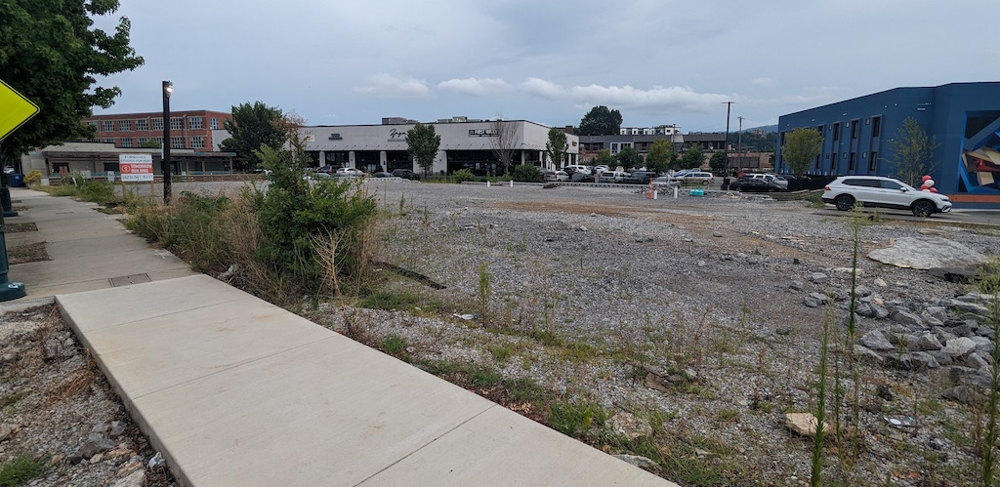

created:: 2023-07-29
updated:: 2023-08-03
status:: draft
public:: false
tags:: Development

- ## *More of the same...*
- 
  <i>The property of 306 Cherokee (me, 2023-08-03)</i>
- **Parcel details**
  + This property is 0.6 acres with an assessed value of $477,960.
  + Chattanooga's property tax is paid at a rate of $2.25 per $100 of assessed valuation, **so this property currently pays $10,754.10 per year in property taxes.**
  + There is currently no building on the parcel, the previous one-story building was demolished sometime around 2021-2022.
  + The property is zoned as "E-CX-4", which is a Commercial Mixed Use zone (E-CX). The digit "4" dictates the maximum height of a building on the property, so 4 stories or 60' max.
  + "E-CX" zones require a building height of "2 stories min."
- Developer proposal
  + The [developer's original proposal in February 2021](https://chattanoogatn.viewpointcloud.com/records/296349) included a two-story building, commercial on the first floor and residential on the second for a total square footage of 15,794.
  + In June 2023, the developer submitted a "[Form Based Code Major Modification Application](https://chattanoogatn.viewpointcloud.com/records/449694)" requesting a variance to reduce the required building stories from two to one. This request was approved in mid-July.
  + This new proposal includes 7,000 square feet of commercial space, which is slated to become [an urgent care](https://chattanoogatn.viewpointcloud.com/records/447686).
  + No residential space is included.
-
- The property of 306 Cherokee falls under the "Urban Edge" Context Area of Chattanooga's [[Form-Based Code]].
- It is currently zoned as "E-CX-4," which is a Commercial Mixed Use zone (E-CX). The digit "4" dictates the maximum height of a building on the property, 4 stories or 60' max. E-CX also requires a height of "2 stories min."
- This is where the story behind this
- On February 18, 2021 the developer of the property at 306 Cherokee held a meeting with the Northside/Cherokee Neighborhood Association. The subject of this meeting was the developer's request to reduce the number of stories of their proposed building, from two to one.
- Their reasoning for this reduction boiled down to a lack of parking. In their [Form Based Code Major Modification Application (FBC-22-15)](https://chattanoogatn.viewpointcloud.com/records/385767), they asserted that "real estate market conditions" require parking at a rate of four spaces per 1,000 square feet, totaling 28 spaces for their proposed building.
- Thankfully, [Chattanooga's Form-Based Code](https://library.municode.com/tn/chattanooga/codes/code_of_ordinances?nodeId=DC)'s parking requirements limit the number of parking spaces needed to just nine. But, in the application, the developer continues to assert that this is "inadequate" and the tenant "already feels parking is limited."
- So, this begs the question, who is the tenant? Why does this building require three times the parking outlined in the Form-Based Code? Is it a highly anticipated restaurant or a new type of business that will bring people in from around the Chattanooga area? The answer, disappointingly, is no. According to this [Zoning Verification Letter](https://chattanoogatn.viewpointcloud.com/records/447686), it is an urgent care center.
  Additional note: There are two other urgent cares within a quarter mile of this property.
- *Anyways...*
- I'm not here to argue over the amount of parking needed for a single story medical office near one of the densest residential areas in Chattanooga. It does sound like fun, but it's much too subjective (even though it shouldn't be).
- What I really want to get at is the lost financial productivity of this development.
- ## *What if this property was developed like others around it?*
-