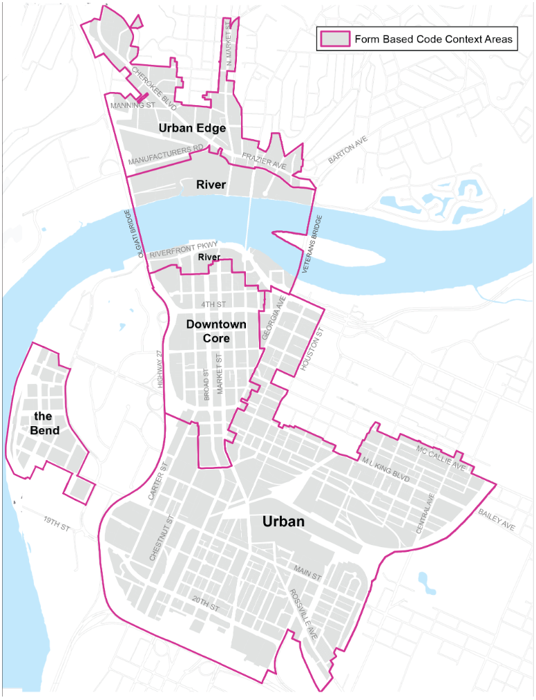

created:: 2023-08-03
updated:: 
status:: draft
public:: true
alias:: FBC

- [Link to Chattanooga's Form-Based Code (FBC)](https://library.municode.com/tn/chattanooga/codes/code_of_ordinances?nodeId=DC)
- From the FBC document linked above: Chattanooga's FBC "provides the means to guide implementation of the citizen-endorsed vision for property within the following five Downtown neighborhoods: North Shore, Riverfront (South Shore), City Center, ML King, Southside, and Westside (The Bend)."
- Below is a map of the areas where the FBC applies.
- 